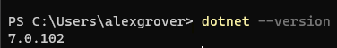

# Viva Connections Lob Sample (SQL)

This solution has been developed to demonstrate how to show SQL data in Viva Connections following Microsoft best practices. 

This ACE shows daily and weekly commission metrics to the end user. These metrics are requested from a SQL database in realtime, using an Azure Function as an intermediary API. Decoupling the ACE and SQL backend using the Azure Function as an API ensures that all the SQL connection permission and logic is not exposed to the end users web client. 

This Azure Function is then turned into and Enterprise API Secured with AAD.

## Overview

This function project contains one function

* [HTTP] GetCommision

This code contains a static class SQLHelper that provides several methods to retrieve commission information for an employee from a SQL database.

The GetEmployeeCommissionDaily method takes in an employeeId and a settings object. The settings object provides information needed to connect to the database and specifies the name of the table and columns to retrieve data from. The method opens a connection to the database, creates a SqlCommand object with a SELECT statement to retrieve the employee's commissionDaily value based on the employeeId, executes the command and returns the value.

The GetEmployeeCommissionWeekly method is similar to the GetEmployeeCommissionDaily method, but it retrieves the employee's commissionWeekly value instead.

The GetEmployeeCommission method retrieves both the employee's commissionDaily and commissionWeekly values and returns a SQLCommissionResponse object that holds these values.

In all methods, the best practice of scoping the SqlConnection to a using block is followed to ensure that the connection is properly closed after use. Additionally, the methods return 0 if no data is found for the given employee.

## Deployment

The deployment of the solution is split into two components. Both have different requirements a prereqs

* The ACE
* The Function

### PreReqs

This a list of the prereqs required to both build and deploy the solutions

* [M365 Developer Tenant](https://learn.microsoft.com/en-us/office/developer-program/microsoft-365-developer-program-get-started) for running Viva Connections
* Azure Subscription (can be a free sub) to deploy the Azure Function to
* Download and install [VSCode](https://code.visualstudio.com) (or another IDE will do, but this guide will focus on VSCode). This will be used to compile and deploy both solutions
* [dotnet 6.0 or later](https://dotnet.microsoft.com/en-us/download/dotnet/6.0) to compile the function code
    * 
* [SPFx development environment](https://learn.microsoft.com/en-us/sharepoint/dev/spfx/set-up-your-development-environment) to compile and build the ACE package
    * Node.js 16
    * 
    * Gulp task runner to continually build the project 
    * 
    * Yeoman scaffolding tool and the SharePoint Framework Yeoman generator. Not actually needed, but required to create new Viva Connections projects
    * 
* [Azure Functions VSCode extension](https://marketplace.visualstudio.com/items?itemName=ms-azuretools.vscode-azurefunctions). This helps streamline the creation and deployment of Azure Functions
    * This should also install [Azure Functions Core Tools](https://www.npmjs.com/package/azure-functions-core-tools). This will allow you to test and debug Azure functions locally
    * 
* [Viva Connections Toolkit VSCode extension](https://marketplace.visualstudio.com/items?itemName=m365pnp.viva-connections-toolkit). This helps streamline the creation of Viva Connections projects and provides a UI for running gulp tasks for building and packaging your solution.
* Other useful extensions for this projects
    * [C#](https://marketplace.visualstudio.com/items?itemName=ms-dotnettools.csharp) - This will provide syntax highlighting and intellisense for working with the Azure Function 
* An accessible SQL database 
    * The database and table used in this sample are as follows:
    * 
* [Postman](https://www.postman.com/downloads/) for API testing

If you have all the above then you are good to proceed. 

### The Function

Once you have the downloaded the repo. I would suggest you first create an function app using the VSCode Extension. You will need to login into the Azure Function extension to enable you to create resources from it.

1. Expand the subscription and right click on Function App. Create Function App in Azure


2. Fill out the prompts.

* Name: ag-viva-connections-sql (must be unique so go with a personal prefix)
* Runtime: .Net 6.0 LTS
* Region: go with something close to your tenant

3. Review status in the Azure Activity Log (a tab in the terminal). Once complete you should see a notification in the bottom right of VSCode


4. Once the function app has been provisioned there are a number of app configuration settings to configure before deploying the code. This can be configured from within the VSCode or the Azure portal. To configure using VSCode, navigate to the Azure function extension, expand the function created in step 2 and right click the Application Settings.


The following four Application Settings are required for the function to execute successfully.

```json
{
    "SQLConString": "Server=tcp:[serverName].database.windows.net;Database=myDataBase;User ID=[loginname]@[serverName];Password=myPassword;Trusted_Connection=False;Encrypt=True;",
    "SQLTableName": "EmployeeCommission",
    "SQLEmployeeIdentifier": "employeeEmail",
    "SQLValueField": "commissionDaily"
}
```

5. Deploy the function. Navigate to the Azure Function extention. Check the Workspace menu for your Local Project. Click on the deploy button then click Deploy to Function App


You will be prompted to choose a subscription and then the Function App that you have just created. Finally you will be prompted to confirmt he deployment


6. Review deployment status in the Terminal. Once complete you should see a notification in the bottom right of VSCode


7. Test

### Configure as Enterprise API

From the Azure Portal navigate to the function app. Go to the Authentication blade and click the `Add Identity provider`. 

Select Microsoft and fill out similar to the below:

//insert screen grab

Once created you can now update the pacakge-soluition.json file for the ACE

## Security  (Enterprise API)

An enterprise API secured with Azure Active Directory (AD) is an API that uses Azure AD as its identity provider to authenticate and authorize access to the API. In this scenario, Azure AD is responsible for verifying the identity of the client that is making a request to the API, and ensuring that the client has the necessary permissions to access the requested resources.

Here's a high-level overview of how an enterprise API secured with Azure AD works:

1. The client application makes a request to the API.

2. The API checks if the request includes a valid access token. If the request does not include a valid access token, the API returns a 401 Unauthorized response.

3. The client application acquires an access token from Azure AD by providing its credentials and the necessary information about the API that it wants to access.

4. The client application includes the access token in the request to the API.

5. The API validates the access token by sending it to Azure AD for verification. Azure AD verifies that the token is valid, has not expired, and was issued to the correct client application.

6. If the token is valid, Azure AD returns information about the authenticated client and the permissions it has been granted to access the API.

7. The API uses the information from Azure AD to authorize access to the requested resources. If the client has the necessary permissions, the API returns the requested data. If the client does not have the necessary permissions, the API returns a 403 Forbidden response.

By securing the API with Azure AD, you can ensure that only authorized clients have access to its resources and can control access to the API using Azure AD's comprehensive identity and access management features. 

Once deployed, these functions will have public API endpoint. However, as they are secured with AAD only authenticated requests from the tenant will be accepted.


## Troubleshooting

Ensure that the SQL server is accepting requests from the Azure Function

``` 
Error in request: Cannot open server 'groveale-sql-server' requested by the login. Client with IP address '20.108.217.137' is not allowed to access the server.  To enable access, use the Windows Azure Management Portal or run sp_set_firewall_rule on the master database to create a firewall rule for this IP address or address range.  It may take up to five minutes for this change to take effect.
```